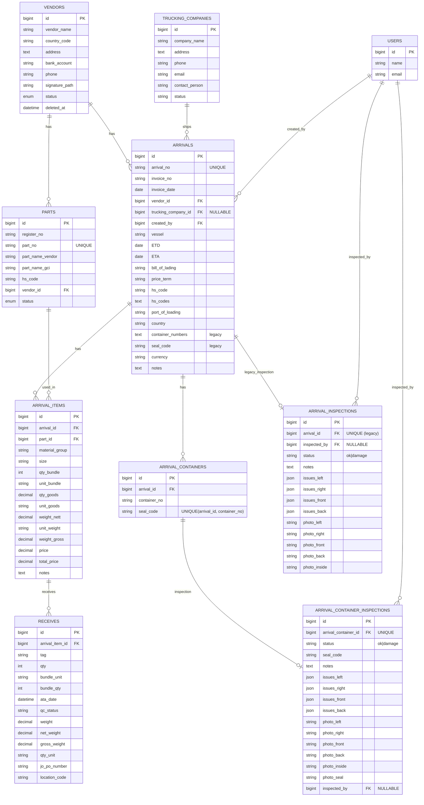

# ERD (Database Diagram)

Di bawah ini ERD utama untuk domain `Incoming` (berdasarkan migration + model Eloquent).

**Catatan**
- `arrival_inspections` = legacy (per-invoice). Implementasi terbaru inspeksi ada di `arrival_container_inspections` (per container).
- Kolom `arrivals.container_numbers` dan `arrivals.seal_code` juga legacy (sekarang lebih akurat pakai `arrival_containers`).

